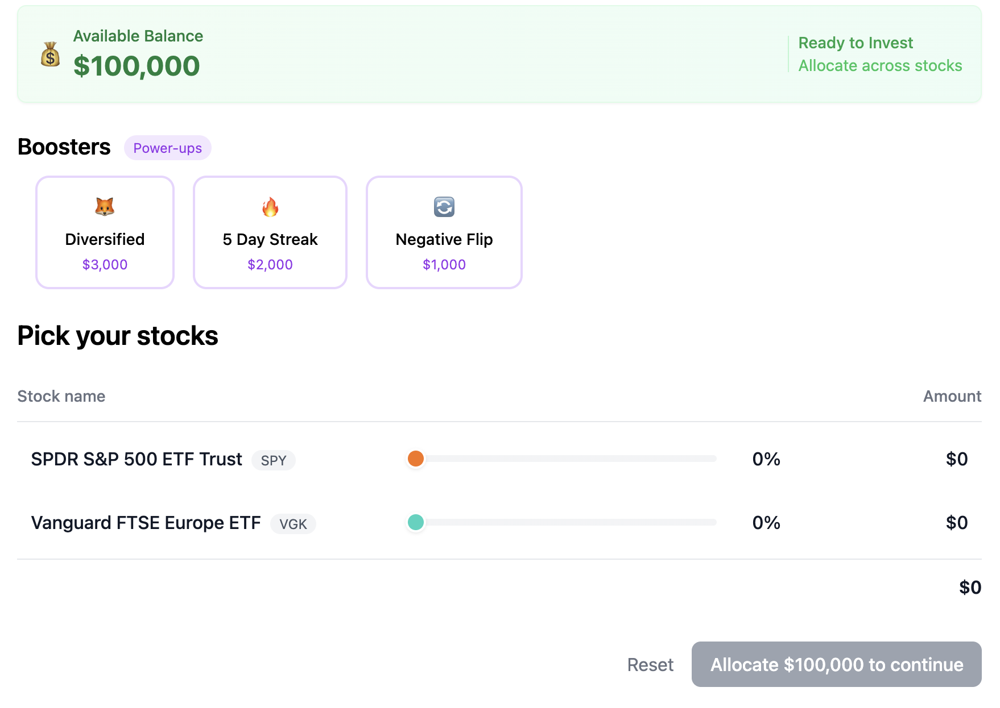

Title: Fantasy Investing Explained: How to Learn Stocks Without Spending a Dime
Date: 16-06-2025
Slug: how-to-learn-stocks-without-spending-a-dime
Image: imgs/Screenshot_2025-06-16_at_7.48.57_PM.png
Author: Jon V
Description: Practice investing with $100K in virtual cash—no real money, no downloads. Ticker makes stocks fun and easy to learn.
Keywords: fantasy investing, risk-free stock trading, stock simulator for beginners, free investing game
Tags: Investing

### **🟡 TL;DR (Too Long; Didn’t Read)**

Want to learn how to invest without risking your money? Fantasy investing is like fantasy football—but for stocks. With Ticker, you get $100,000 in virtual cash to play the market, test your strategy, and challenge friends. No pressure. No jargon. Just fun, risk-free investing.

---

### **💡 Fantasy Investing Explained: How to Learn Stocks Without Spending a Dime**

---

### **💸 What is Fantasy Investing?**

**Fantasy investing** is a risk-free way to practice trading stocks using virtual money. Think of it like a stock market simulator that lets you build a pretend portfolio and test your strategy—without using real cash.

#### **👇 Quick Definition (for Featured Snippet)**

**Fantasy investing** is a simulation of the stock market that lets you trade with virtual money to practice investing strategies without financial risk.

---

### **📱 How Ticker Makes Fantasy Investing Actually Fun**

#### **H3: $100K in Virtual Cash. No App Download Required.**

With **Ticker**, you instantly get a fake $100,000 to build your dream portfolio. Just use the slider to set how much to invest in each stock. No complex charts, no overwhelming data.

#### **H3: Trade. Learn. Repeat.**

- Try out real-world investing ideas
- Watch how your picks perform
- Compete with friends for fun
- Learn how the market works—without losing sleep

#### **H3: Built for Beginners, Not Wall Street Bros**

- No jargon or finance lingo
- Visual, game-like interface
- Safe, educational environment

---

### **🎮 Why Practice Investing Without Real Money?**

- Build confidence in your investing decisions
- Learn how market trends affect your portfolio
- Avoid expensive mistakes when you do invest real money
- Discover what type of investor you are (risky? cautious? somewhere in between?)

---

### **🔄 How to Get Started with Fantasy Investing**

1. Head to[ heyticker.com](https://heyticker.com/ "‌")
2. Create your free account—no credit card, no app required
3. Start building your fantasy stock portfolio
4. Invite your friends and create challenges
5. Track your progress and learn over time

---

### **❓FAQs About Fantasy Investing**

#### **Is fantasy investing legit?**

Yes! Fantasy investing is a legit way to learn how the market works without risking money. It’s often used in schools, training, and for fun.

#### **Can I win real money?**

Not with Ticker—and that’s the point. Ticker is all about **safe, educational investing** with no financial risk.

#### **Is it free to use?**

Yes. Ticker is 100% free.

---

### **🏁 Final Thoughts: Investing Shouldn’t Be Scary**

If you’ve ever felt intimidated by stocks or confused by charts, fantasy investing with **Ticker** is the perfect way to dip your toes in. It’s easy, fun, and totally free—because learning about money should never cost you yours.
